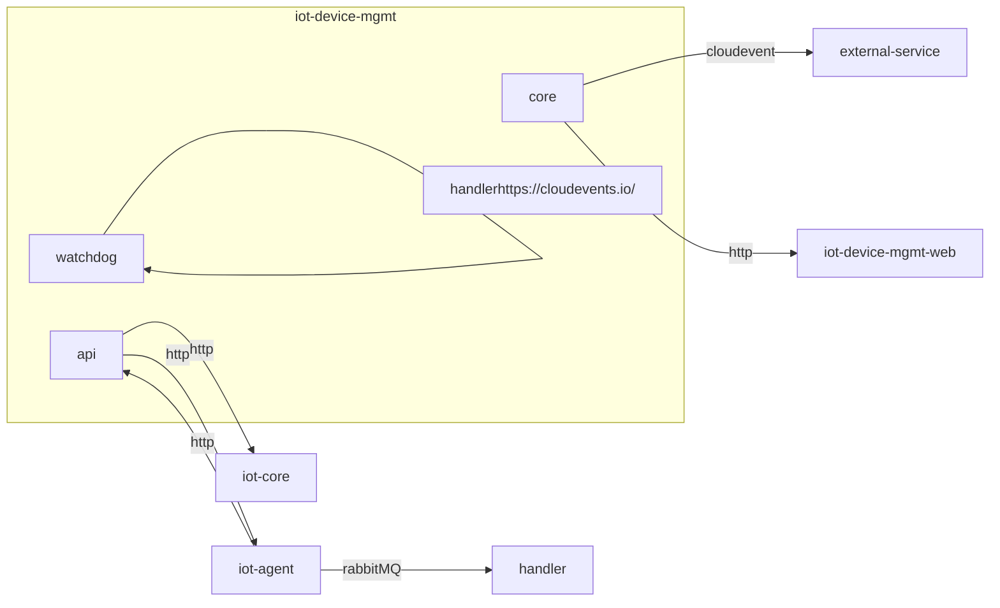

# iot-device-mgmt

Device management service

# Design


## Dependencies 
# Storage
When the service is started data will be loaded from configuration files and stored in a database. If `DIWISE_SQLDB_HOST` is set, postgreSql will be use. If not, sqlite is used instead.
# Watchdog
Watchdog is a feature that will periodically verify the sensors. Currently only last observed time is checked. If larger than `interval` a warning status will be set. 
# Security
## Authorization
Authorization is handled via OIDC access tokens that are delegated to [Open Policy Agent](https://www.openpolicyagent.org) for validation and decoding. This service does not impose any restrictions on the structure of a token's claims, allowing freedom for policy writers to integrate with existing organisational policies more easily.

The only requirement is that the policy evaluation result is an object that contains a list of the tenants that the client is allowed to access. This list can be fetched from an arbitrary claim in the access token or created in the policy file based on other properties such as groups or subject identity (sub).

A [basic policy file](./assets/config/authz.rego) is included in the built image by default, but is expected to be replaced with an organisational specific policy at the time of deployment.

# Configuration

## Environment variables
```json
"RABBITMQ_HOST": "<rabbit mq hostname>"
"RABBITMQ_PORT": "5672"
"RABBITMQ_VHOST": "/"
"RABBITMQ_USER": "user"
"RABBITMQ_PASS": "bitnami"
"RABBITMQ_DISABLED": "false"
"SERVICE_PORT": "<8080>",
"DIWISE_SQLDB_HOST": "url to postgreSql database"
```
## CLI flags
 - `devices` - A directory containing data of known devices (devices.csv) & sensorTypes (sensorTypes.csv)
 - `policies` - An authorization policy file
 - `notifications` - Configuration file for notifications via cloud events

## Configuration files
First row of csv-files contains headers.
### 10.sensorTypes.csv
```
name;description;interval
qalcosonic;;3600
presence;;3600
elsys_codec;;3600
enviot;;3600
tem_lab_14ns;;3600
strips_lora_ms_h;;3600
cube02;;3600
```
 - `name` - name of decoder for the type of sensor
 - `description` - description, free text
 - `interval` - number of seconds between readings, if longer status will be set to warning
### 20.environments
```
name
water
air
indoors
lifebuoy
soil
```
 - `name` - name of environment
### 30.devices.csv
```
devEUI;internalID;lat;lon;where;types;sensorType;name;description;active;tenant;interval
a81758fffe06bfa3;intern-a81758fffe06bfa3;62.39160;17.30723;water;urn:oma:lwm2m:ext:3303,urn:oma:lwm2m:ext:3302,urn:oma:lwm2m:ext:3301;Elsys_Codec;name-a81758fffe06bfa3;desc-a81758fffe06bfa3;true;default;0
```
 - `devEUI` - id of physical sensor
 - `internalID` - internal id that will be used within the diwise plattform
 - `lat` - latitude 
 - `lon` - longitude
 - `where` - environment
 - `types` - measurement types that will be converted from the sensor payload
 - `sensorType` - name of decoder that the sensor will use 
 - `name` - display name of sensor
 - `description` - description
 - `active` - if set to false measurements will not be delivered
 - `tenant` - name of tenant 
 - `interval` - overrides interval set in sensorTypes
### notifications.yaml
Configuration if a [cloud event](https://cloudevents.io/) should be sent to the configured endpoint.
```yaml
notifications:
  - id: qalcosonic
    name: Qalcosonic W1 StatusCodes
    type: diwise.statusmessage
    subscribers:
    - endpoint: http://endpoint/api/cloudevents
```
# Links
[iot-device-mgmt](https://diwise.github.io/) on diwise.github.io
