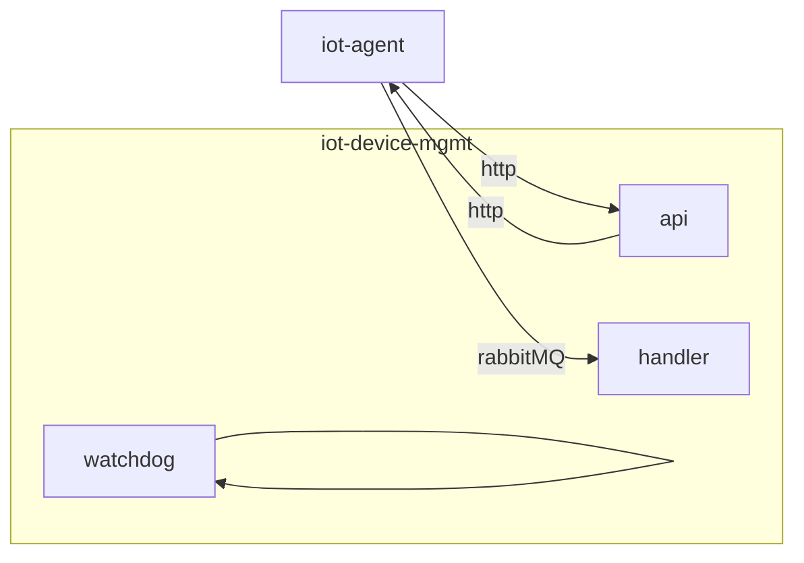

# iot-device-mgmt

Device management service.

# Design


```mermaid
flowchart LR
    iot-agent --http--> api --http--> iot-agent
    iot-agent --rabbitMQ-->handler
    subgraph iot-device-mgmt
        api
        handler
        watchdog-->watchdog
    end
```

## Dependencies 

# Stable public packages

`pkg/client`, `pkg/types` and `pkg/test` form the stable public Go API
of this module. External consumers include iot-agent (device lookup
and creation, sensor models, client mocks) and iot-core (device
management client and mocks).

Rules for these packages:

- Do not rename/move packages, types, fields, JSON tags, topics,
  content types or client methods without a compatibility/migration
  plan and contract tests on the consumer side.
- Regenerate the `pkg/test` mocks with moq after any interface change.
- Release order: release iot-device-mgmt first, then upgrade and
  verify each consumer (notably iot-agent and iot-core) before
  removing old API.

# Storage
Storage is PostgreSQL/pgx only. At startup the service connects to PostgreSQL, runs schema initialization, and seeds LwM2M types, sensor profiles, sensors and devices from configuration files. There is no SQLite fallback.

# Watchdog
Watchdog is a feature that will periodically verify the sensors. Currently only last observed time is checked. If larger than `interval` a warning status will be set. 

# Security

## Authorization
Authorization is handled via OIDC access tokens that are delegated to [Open Policy Agent](https://www.openpolicyagent.org) for validation and decoding. This service does not impose any restrictions on the structure of a token's claims, allowing freedom for policy writers to integrate with existing organisational policies more easily.

By default the policy evaluation result must contain a `tenants` list with the tenants that the client is allowed to access. This list can be fetched from an arbitrary claim in the access token or created in the policy file based on other properties such as groups or subject identity (sub).

The access-object authorization model can be enabled with `AUTHZ_ACCESS_OBJECT_ENABLED=true` or `-authz-access-object=true`. In that mode the policy result must contain an `access` object that maps tenant names to allowed scopes, for example `{"access":{"default":["devices.read","devices.update"]}}`.

A [basic policy file](./assets/config/authz.rego) is included in the built image by default, but is expected to be replaced with an organisational specific policy at the time of deployment.

# Configuration

## Environment variables
```json
"RABBITMQ_HOST": "<rabbit mq hostname>"
"RABBITMQ_PORT": "5672"
"RABBITMQ_VHOST": "/"
"RABBITMQ_USER": "user"
"RABBITMQ_PASS": "bitnami"
"RABBITMQ_DISABLED": "false"
"SERVICE_PORT": "<8080>",
"AUTHZ_ACCESS_OBJECT_ENABLED": "false",
"POSTGRES_HOST": "url to postgresql database"
```
## CLI flags
 - `devices` - A directory containing data of known devices (devices.csv) & sensorTypes (sensorTypes.csv)
 - `policies` - An authorization policy file
 - `authz-access-object` - Enable the access-object authorization policy result model
 - `config` - Device management configuration file (`config.yaml`)
 - `devmode` - Enable dev mode (parsed but currently unused after parsing)
 - `loglevel` - Set the log level (overrides `LOG_LEVEL`)

## Faktisk konfiguration (kod ar facit, HARM-002)
Precedens: default < miljovariabel < CLI-flagga. RabbitMQ konfigureras via `messaging.LoadConfiguration`.

| Variabel | Default | Notering |
| --- | --- | --- |
| `LISTEN_ADDRESS` | `0.0.0.0` | Galler bade publik server och kontrollserver |
| `SERVICE_PORT` | `8080` | Publik server (`/api/v0/...`, `/openapi.yaml`, `/docs`) |
| `CONTROL_PORT` | `8000` | Kontrollserver: pprof, liveness, readiness-stubbar (`rabbitmq`, `timescale`) som returnerar OK |
| `POLICIES_FILE` | `/opt/diwise/config/authz.rego` | Kravs vid startup |
| `AUTHZ_ACCESS_OBJECT_ENABLED` | `false` | Switches between the `tenants` and `access` result models (see Security above) |
| `ALLOWED_SEED_TENANTS` | `default` | Kommaseparerad lista vid seedning |
| `SEED_EXISTING_DEVICES` | `true` |  |
| `POSTGRES_HOST` | (tom) | Lagring ar enbart PostgreSQL/pgx i nulaget |
| `POSTGRES_PORT` | `5432` |  |
| `POSTGRES_DBNAME` | `diwise` |  |
| `POSTGRES_USER` | (tom) |  |
| `POSTGRES_PASSWORD` | (tom) |  |
| `POSTGRES_SSLMODE` | `disable` |  |
| `ENABLE_TRACING` | `true` | Tracing pa publik server |
| `LOG_LEVEL` | `debug` | `debug`, `info`, `warn`/`warning`, `error`; okant varde faller tillbaka till `debug`. Styrs aven via `-loglevel` |
| `RABBITMQ_HOST` | (tom, kravs om inte avstangd) | Se `messaging.LoadConfiguration` |
| `RABBITMQ_PORT` | `5672` |  |
| `RABBITMQ_VHOST` | `/` |  |
| `RABBITMQ_USER` | `user` |  |
| `RABBITMQ_PASS` | `bitnami` |  |
| `RABBITMQ_DISABLED` | `false` |  |
| `RABBITMQ_INIT_TIMEOUT` | `10` | Sekunder |
| `POSTGRES_MAX_CONNS` | `10` |  |
| `POSTGRES_MIN_CONNS` | `2` |  |
| `POSTGRES_MAX_CONN_LIFETIME` | `30m` |  |
| `POSTGRES_MAX_CONN_IDLE_TIME` | `5m` |  |
| `POSTGRES_HEALTH_CHECK_PERIOD` | `30s` |  |

Filer som kravs vid startup: `config.yaml` (default `/opt/diwise/config/config.yaml`), `devices.csv` (default `/opt/diwise/config/devices.csv`), `authz.rego` (default `/opt/diwise/config/authz.rego`).

Health paths pa kontrollservern (`CONTROL_PORT`): `/health`, `/healthz`, `/livez`, `/readyz`, `/readyz/{check}`.

# Startup

1. Read defaults, environment variables and CLI flags (precedence: default < env < CLI).
2. Open and parse `config.yaml`, the OPA policy file and `devices.csv`.
3. Initialize storage (PostgreSQL + schema) and messaging in `OnInit`.
4. Seed LwM2M types, sensor profiles, sensors and devices, start messaging, register the two `device-status` consumers and start the watchdog in `OnStarting`.
5. Serve the public API on `SERVICE_PORT` and liveness/readiness on `CONTROL_PORT`.
6. On shutdown: stop the watchdog, close messaging and close storage (idempotent, each exactly once).

# API

The public HTTP API lives under `/api/v0` with bearer-token authorization (see Security above): `sensors`, `devices` (including `{id}/status`, `{id}/alarms`, `{id}/measurements`, `{id}/sensor`), `alarms`, and `admin` (`deviceprofiles`, `lwm2mtypes`, `tenants`). The full route and model reference is `assets/docs/openapi.yaml`, served as `/openapi.yaml` with Redoc UI at `/docs`. The service consumes `device-status` messages over RabbitMQ.

# Verification

```bash
gofmt -l cmd/ internal/ pkg/
go test -count=1 ./...
go vet ./...
go build -o /tmp/iot-device-mgmt ./cmd/...
```

Database-backed tests skip explicitly when no PostgreSQL is reachable; unit and contract tests always run.

Externa Kubernetes- och Compose-definitioner finns inte i detta repo och ar darfor inte inventerade har.

## Configuration files
First row of csv-files contains headers.
### devices.csv
```
devEUI;internalID;lat;lon;where;types;sensorType;name;description;active;tenant;interval;source
a81758fffe06bfa3;intern-a81758fffe06bfa3;62.39160;17.30723;water;urn:oma:lwm2m:ext:3303,urn:oma:lwm2m:ext:3302,urn:oma:lwm2m:ext:3301;elsys;name-a81758fffe06bfa3;desc-a81758fffe06bfa3;true;default;0;origin
```
 - `devEUI` - id of physical sensor
 - `internalID` - internal id that will be used within the diwise plattform
 - `lat` - latitude 
 - `lon` - longitude
 - `where` - environment
 - `types` - measurement types that will be converted from the sensor payload
 - `sensorType` - name of decoder that the sensor will use 
 - `name` - display name of sensor
 - `description` - description
 - `active` - if set to false measurements will not be delivered
 - `tenant` - name of tenant 
 - `interval` - overrides interval set in sensorTypes
 - `source` - name of the source

# Links
[iot-device-mgmt](https://diwise.github.io/) on diwise.github.io
